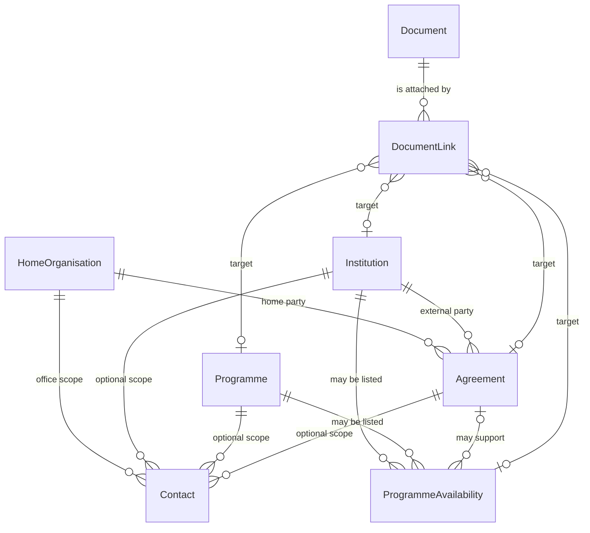

# Future data model for the DoIC platform

This note proposes how the Directorate of International Collaboration (DoIC) site could store records later. It is a schema proposal only. It does not add a database, change the site, or fill official facts.

The current module `src/lib/data.ts` is labeled there as demo data. Its institution names, city pins, programme sentences, and home-page counts are illustrative. None of them are treated below as a signed agreement, a live statistic, or a contact.

Manipal University Jaipur (MUJ) is the home party. An external university is an institution. A formal relationship is an agreement. A way of studying or visiting is a programme. The fact that a particular institution actually offers a particular programme to students is a separate link, called programme availability. Those are not the same object.

---

## 1. Entity and relationship diagram



A row exists only when DoIC records it. An institution with no agreement is still an institution. A programme with no availability rows is still a programme description. The diagram’s optional ends are deliberate: the model must not invent the missing link.

---

## 2. Relationship explanation

**Home organisation.** One record for MUJ and the office that manages international work: the Directorate of International Collaboration, managed by the International Student Cell. This is not a partner institution. The globe’s Jaipur point and the public campus address belong here.

**Institution.** Answers “who might MUJ be connected with?” It holds identity and place: name, country, region, city, coordinates, and, later, a website. It does not hold agreement status, dates, or programme rules. Putting those on the institution would make every reader treat an unknown relationship as known.

**Agreement.** Answers “what formal relationship exists?” Each agreement belongs to one institution and to the home organisation. It has its own type, status, start and end, academic areas, and a reference to a document if one is later filed. An institution may have none, one, or several agreements over time. Absence of a row means “not recorded,” not “no relationship” and not “an active memorandum.”

**Programme.** Answers “what international opportunity exists?” as a description DoIC is willing to publish. The type is one of the four categories already used on the site: Student Exchange, Semester Exchange, Pathway Programs, Academic Visits. A programme has a name, a description, and a general audience. It does not name a destination and does not state eligibility, fees, deadlines, or credit.

**Programme availability.** Answers “which institution and programme combination is actually available to students?” This is its own table. A row exists only for a pair DoIC has confirmed. It must not be generated by crossing every institution with every programme. Future columns may hold eligibility, whether the pair is open, an application period, duration, and credit information. Until DoIC supplies those values, the columns stay empty. An agreement may later be cited as what supports a row, but an agreement does not by itself create availability, and availability does not by itself prove an agreement.

**Contact.** Answers “who handles this?” A contact is an office or a person, with type, name, email, phone, and role. It may be scoped to the home office, an institution, an agreement, or a programme. The table is defined so those fields have a place. It stays empty until official information is supplied. The campus postal lines in the current file are an address for the home organisation, not a named officer.

**Document and document link.** A document is the file or reference: an official memorandum, a brochure, a programme note, or a related resource. A link attaches that document to an institution, an agreement, a programme, or one availability row. One document can be linked more than once. The file itself would live in file storage; the database would store the reference, title, and kind.

---

## 3. Proposed schema

Names below are proposed fields. Enumerations marked “proposed vocabulary” are for the schema. They are not an adopted DoIC classification, and no current page should display them as if a record used them.

### Home organisation

| Field | Purpose |
| --- | --- |
| id | Stable key. |
| universityName | Manipal University Jaipur, from the current site copy. |
| shortName | MUJ. |
| directorate | Directorate of International Collaboration. |
| cell | International Student Cell. |
| city, country | Jaipur, India. |
| latitude, longitude | Home-campus point used by the globe. |
| postalLines | The two address lines already published in `contact.lines`. |

### Institution

| Field | Purpose |
| --- | --- |
| id | Surrogate key. Not a slug made from a sample name. |
| name | Institution name. |
| country | Country. |
| region | Directory region. The current vocabulary is Europe, Middle East, Asia-Pacific, North America. Extend it only when DoIC needs another region. |
| city | City used for the directory. |
| latitude, longitude | Position DoIC accepts for that institution. Nullable until checked. |
| website | Nullable. Empty until an official URL is supplied. |

Do not add agreement type, status, or dates to this table.

### Agreement

| Field | Purpose |
| --- | --- |
| id | Surrogate key. |
| institutionId | The external institution. Required. |
| homeOrganisationId | MUJ / DoIC. Required. |
| agreementType | Proposed vocabulary, unset until defined: memorandum, exchange agreement, or other. Nullable. |
| status | Proposed vocabulary, unset until defined: draft, active, expired, ended. Nullable. No row should be displayed as active without this field set from an official source. |
| startDate, endDate | Nullable dates. |
| academicAreas | List of areas. Empty until supplied. |
| documentReference | Optional pointer to a document id, or an external reference string. Nullable. |

### Programme

| Field | Purpose |
| --- | --- |
| id | Surrogate key. |
| name | Public name. |
| type | One of: `student-exchange`, `semester-exchange`, `pathway-programs`, `academic-visits`. |
| description | What the programme is, in the wording DoIC publishes. |
| generalAudience | Who it is generally for, only to the extent DoIC states it. Nullable when the description does not say. |

The four type values match the existing categories:

| type | Public name |
| --- | --- |
| student-exchange | Student Exchange |
| semester-exchange | Semester Exchange |
| pathway-programs | Pathway Programs |
| academic-visits | Academic Visits |

### Programme availability

| Field | Purpose |
| --- | --- |
| id | Surrogate key. |
| institutionId | Required. |
| programmeId | Required. |
| agreementId | Optional. Set only when an agreement is the stated basis. |
| eligibility | Nullable text or structured rule. Not guessed. |
| availability | Nullable. Proposed vocabulary: open, closed, suspended. Empty means “not recorded,” not “open.” |
| applicationPeriodStart, applicationPeriodEnd | Nullable dates. |
| duration | Nullable. |
| creditInformation | Nullable. |
| notes | Nullable publisher note. |

Uniqueness: one row per institution and programme pair, unless DoIC later needs more than one offering of the same pair. Do not insert a row to “complete” a matrix.

### Contact

| Field | Purpose |
| --- | --- |
| id | Surrogate key. |
| contactType | Proposed: office or person. |
| name | Nullable. |
| email | Nullable. |
| phone | Nullable. |
| role | Nullable. |
| homeOrganisationId | Set when the contact is the DoIC office. |
| institutionId | Set when the contact is for one institution. |
| agreementId | Set when the contact is for one agreement. |
| programmeId | Set when the contact is for one programme. |

At least one scope should be set when a row is created. Until official information exists, create no rows.

### Document and document link

| Document field | Purpose |
| --- | --- |
| id | Surrogate key. |
| title | Label for staff and, if published, for the public site. |
| kind | Proposed: mou, brochure, programme-document, other. |
| storageKey | Location of the file. Nullable if only a citation exists. |
| citation | External reference. Nullable. |

| Document link field | Purpose |
| --- | --- |
| id | Surrogate key. |
| documentId | The document. |
| institutionId | Optional target. |
| agreementId | Optional target. |
| programmeId | Optional target. |
| programmeAvailabilityId | Optional target. |

A link row sets exactly one target. A document that belongs in two places gets two links.

---

## 4. Example records

The JSON and the TypeScript below use invented identifiers and place names so the shape is visible. They are examples, not DoIC records. They are not the sample universities in `src/lib/data.ts`, and they are not agreements of Manipal University Jaipur.

```json
{
  "notice": "EXAMPLE ONLY. Not a DoIC record. Not an agreement. Not a statistic.",
  "homeOrganisation": {
    "id": "home-muj",
    "universityName": "Manipal University Jaipur",
    "shortName": "MUJ",
    "directorate": "Directorate of International Collaboration",
    "cell": "International Student Cell"
  },
  "institutions": [
    {
      "id": "ex-inst-harbour",
      "name": "Example Harbour University",
      "country": "Exampleland",
      "region": "Europe",
      "city": "Northport",
      "latitude": null,
      "longitude": null,
      "website": null
    }
  ],
  "agreements": [
    {
      "id": "ex-agr-harbour-1",
      "institutionId": "ex-inst-harbour",
      "homeOrganisationId": "home-muj",
      "agreementType": null,
      "status": null,
      "startDate": null,
      "endDate": null,
      "academicAreas": [],
      "documentReference": null
    }
  ],
  "programmes": [
    {
      "id": "ex-prog-exchange",
      "name": "Student Exchange",
      "type": "student-exchange",
      "description": "Example sentence describing a term away. Not a DoIC regulation.",
      "generalAudience": null
    }
  ],
  "programmeAvailability": [
    {
      "id": "ex-avail-1",
      "institutionId": "ex-inst-harbour",
      "programmeId": "ex-prog-exchange",
      "agreementId": null,
      "eligibility": null,
      "availability": null,
      "applicationPeriodStart": null,
      "applicationPeriodEnd": null,
      "duration": null,
      "creditInformation": null
    }
  ],
  "contacts": [],
  "documents": [],
  "documentLinks": []
}
```

The availability row is here only to show the foreign keys. A real load would omit it until DoIC confirms that Example Harbour University offers Student Exchange. An empty `programmeAvailability` array is the honest state for the current site.

```ts
/** EXAMPLE SHAPES. Not DoIC records. Null means "not supplied," never "none" or "open." */

type Region = "Europe" | "Middle East" | "Asia-Pacific" | "North America";

type ProgrammeType =
  | "student-exchange"
  | "semester-exchange"
  | "pathway-programs"
  | "academic-visits";

/** Proposed labels only. Do not display them until DoIC adopts them. */
type AgreementType = "memorandum" | "exchange-agreement" | "other";
type AgreementStatus = "draft" | "active" | "expired" | "ended";
type AvailabilityState = "open" | "closed" | "suspended";
type ContactType = "office" | "person";
type DocumentKind = "mou" | "brochure" | "programme-document" | "other";

interface HomeOrganisation {
  id: string;
  universityName: string;
  shortName: string;
  directorate: string;
  cell: string;
  city: string;
  country: string;
  latitude: number;
  longitude: number;
  postalLines: readonly string[];
}

interface Institution {
  id: string;
  name: string;
  country: string;
  region: Region;
  city: string;
  latitude: number | null;
  longitude: number | null;
  website: string | null;
}

interface Agreement {
  id: string;
  institutionId: string;
  homeOrganisationId: string;
  agreementType: AgreementType | null;
  status: AgreementStatus | null;
  startDate: string | null;
  endDate: string | null;
  academicAreas: readonly string[];
  documentReference: string | null;
}

interface Programme {
  id: string;
  name: string;
  type: ProgrammeType;
  description: string;
  generalAudience: string | null;
}

interface ProgrammeAvailability {
  id: string;
  institutionId: string;
  programmeId: string;
  agreementId: string | null;
  eligibility: string | null;
  availability: AvailabilityState | null;
  applicationPeriodStart: string | null;
  applicationPeriodEnd: string | null;
  duration: string | null;
  creditInformation: string | null;
}

interface Contact {
  id: string;
  contactType: ContactType;
  name: string | null;
  email: string | null;
  phone: string | null;
  role: string | null;
  homeOrganisationId: string | null;
  institutionId: string | null;
  agreementId: string | null;
  programmeId: string | null;
}

interface Document {
  id: string;
  title: string;
  kind: DocumentKind;
  storageKey: string | null;
  citation: string | null;
}

interface DocumentLink {
  id: string;
  documentId: string;
  institutionId: string | null;
  agreementId: string | null;
  programmeId: string | null;
  programmeAvailabilityId: string | null;
}
```

---

## 5. How `src/lib/data.ts` maps

The file is the visual baseline. It is not a normalised store. The mapping says where each current field would go if DoIC later confirms it. It does not confirm it.

| Current value | Future place | Status |
| --- | --- | --- |
| `site.university`, `site.universityShort`, `site.directorate`, `site.cell` | `HomeOrganisation` | Public names of the home party. Suitable to carry forward as office identity, not as a partner. |
| `hub` (Jaipur coordinates) | `HomeOrganisation.latitude` / `longitude` | Home point for the globe. |
| `contact.lines` | `HomeOrganisation.postalLines` | Campus postal address already written in the file. |
| `contact.note` | No contact row | States that a public contact channel is still to be published. Do not turn the note into an email or a person. |
| `contact.office`, `contact.cell`, `contact.university` | Same as `site` | Repeated labels, not a second organisation. |
| `partners[].id` | Not an institution id | It is a country key (`united-kingdom`, `germany`, and so on). |
| `partners[].country`, `region`, `city` | Fields on each future `Institution` only after a real institution is split out of the country group | Today one pin and one city stand for every name in `universities`. |
| `partners[].lat`, `partners[].lon` | Not automatically `Institution` coordinates | The file says these are city positions. Several sample names under one country do not share that city. Birmingham and Lancaster are listed on the London pin. A future institution coordinate has to be checked per institution. |
| `partners[].universities[]` | Candidate `Institution.name` values only | The file calls them sample names, not a memorandum list. Do not load them as confirmed partners. |
| `partners[].summary` | Not an agreement and not availability | Country-level illustrative sentence. If kept, it is editorial copy, not a fact on the institution or the agreement. |
| `opportunities[].id` and `title` | `Programme.id` / `name` / `type` | The four categories are the programme types the schema must support. The sentences are the current descriptions, not regulations. |
| `opportunities[].summary` | `Programme.description` | Illustrative wording. `generalAudience` stays null unless a later official text states it. The present UI does not treat these sentences as eligibility. |
| `opportunities[].href`, `icon` | Not stored | Presentation only. |
| `networkStats` | Not a table of institutions or programmes | Illustrative counts for the home page. They must not be computed from sample names and then shown as official totals. |
| `classroomPoints` | Not an entity | Editorial lines about the office’s role. |
| `primaryNav`, `portalNav`, `legalNav` | Not an entity | Site chrome. |
| Slugs derived in the page layer from sample university names | Not future primary keys | They exist so the current directory can open a page. A database id should be assigned by the store, not by normalising a sample string. |

What the current shape collapses, and the future model must undo:

- Several institution names share one country object, one city, and one coordinate pair.
- No agreement row exists, so the UI correctly says agreement status is not published.
- No availability row exists, so a programme page must not list those sample names as destinations.
- Contacts are an address and a sentence, not a person.

---

## 6. Fields that cannot be populated now

Official data is missing. Leave these empty. Do not fill them from the sample list or from the home-page counts.

**Institution.** A confirmed set of partner names. A checked coordinate for each institution, as distinct from the shared city pin. Any website.

**Agreement.** Whether any institution has a memorandum or another instrument. Type, status, start, end, academic areas, and a document reference. The sample names are not evidence of these.

**Programme.** Official description text if it differs from the four illustrative summaries. An official statement of general audience. Eligibility, fees, deadlines, duration, and credit are not on the programme itself in this proposal; they belong on availability, and they are also missing.

**Programme availability.** Every combination. The current file never links a named institution to Student Exchange, Semester Exchange, Pathway Programs, or Academic Visits. No application window, duration, credit note, or open/closed flag is known. Do not create the full cross-product.

**Contact.** Office type used as a real channel, person name, email, phone, and role. The published note says a public contact address is still to come. Staff names are not in the file.

**Document.** Memorandum files, brochures, programme documents, and any other resource, including where they would attach.

**Counts.** `networkStats` (the illustrative university, country, programme, and student figures) are not row counts of this model and are not official totals.

---

## 7. Recommendation

Use a relational database as the system of record, with file storage for document binaries.

The relationships are the reason:

- An institution has zero or many agreements. That is a foreign key on the agreement, with a constraint that the institution exists. A document or a single JSON object per “partner” would hide a second agreement, or would copy status back onto the institution.
- Programmes and institutions are many-to-many, and only some pairs are real. Programme availability is that link. A relational unique constraint on `(institutionId, programmeId)` stops a duplicate offering and, more importantly, stops the application from assuming the Cartesian product. A nested array of all programme types on each institution would recreate the mistake this model is meant to avoid.
- An availability row may optionally point at an agreement. That is a nullable foreign key, not a copy of the agreement’s dates onto the institution and not a copy of the programme text onto the agreement.
- Contacts are few, scoped to different parents, and empty today. A contact table with nullable scope keys stays empty without blocking the rest of the model. Stuffing a contact object onto every institution would imply a person where none is published.
- Documents attach to institutions, agreements, programmes, or a single availability row. A link table expresses “this file belongs here” without merging the file’s metadata into those entities. The bytes belong in object storage; the row stores the key, the kind, and the links. A database is a poor place for the PDF itself, and a folder of files is a poor place for the question “which agreement does this file support?”

A document database, or one JSON file per institution, would fit the current demo file, because that file already nests names under a country. It would not fit the rules above. Queries the directorate will actually ask — agreements for this institution, institutions for this programme, documents for this agreement, contacts for this office — are joins. They should fail closed when the row is absent.

PostgreSQL is a sound default: foreign keys, unique pairs, dates, and JSON only where a future eligibility note is still unstructured. The recommendation is the relational shape, not a vendor commitment and not an implementation.

No migration of `src/lib/data.ts` is proposed here. When official lists exist, load home organisation, then programmes (the four types), then institutions DoIC confirms, then agreements, then availability, then contacts and documents. Leave every unconfirmed column null.
